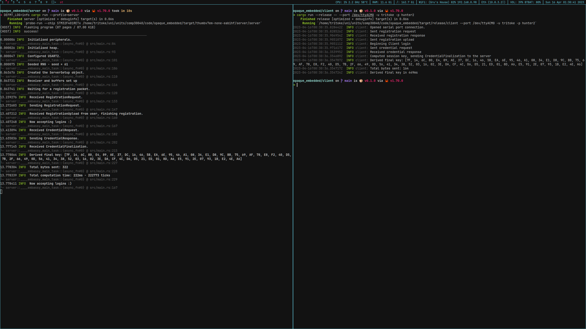

# opaque_embedded
A repository to hold the code for an example embedded application utilising OPAQUE and Rust.

# Running the code
You will need an NUCLEO-F401RE, but after that it should look like this:

